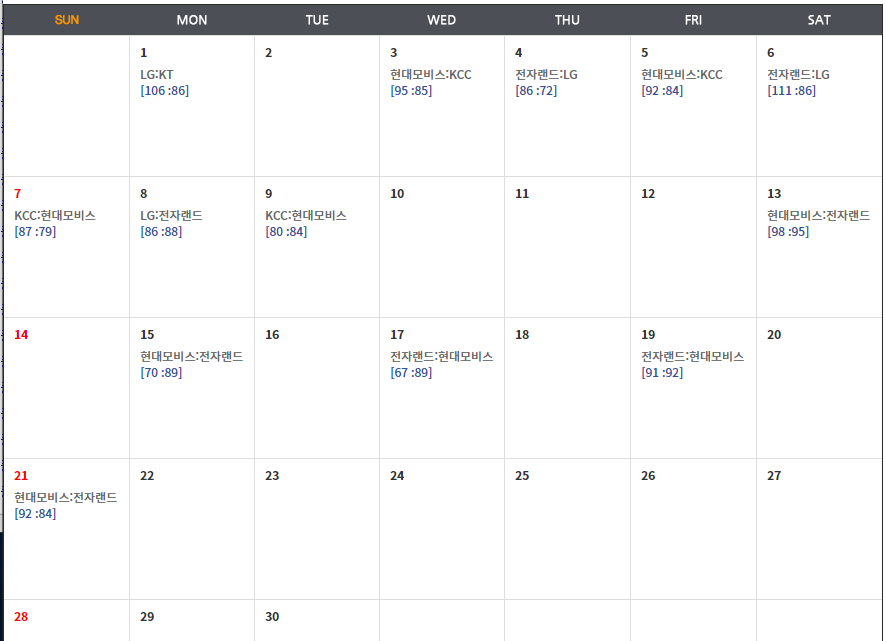
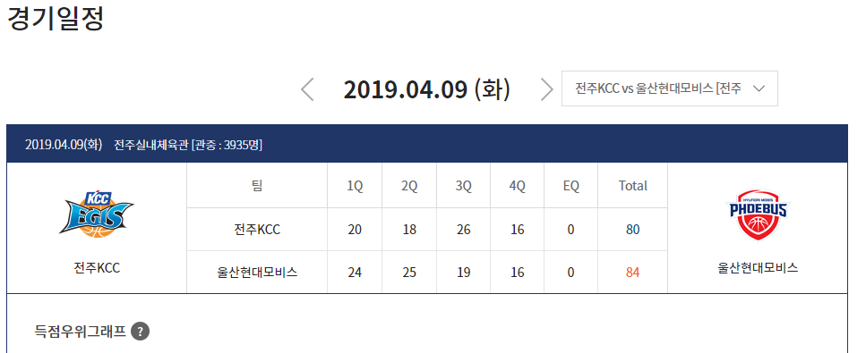

# 개요
한국 프로 남자 농구 데이터를 csv로 가져오기. python.
python 의 selenium으로 가져왔습니다. chromeDriver 사용했습니다. 

https://www.kbl.or.kr/schedule/today/calendar.asp

이 사이트에서 날짜별로 경기가 나와있고, 

해당 경기를 클릭하면 세부정보가 나옵니다.

세부정보에서 원하는 정보들만 골라서 다음과 같이 csv파일로 저장하게 됩니다. 

pythonIDEl로 실행할때도 chrome.prompt 창이 안뜨게 했는데, 

Lib/selenium/webdriver/common/service.py 에서
72번째 줄
'''self.process = subprocess.Popen(cmd, env=self.env,
                                            close_fds=platform.system() != 'Windows',
                                            stdout=self.log_file,
                                            stderr=self.log_file,
                                            stdin=PIPE) '''
를 '''self.process = subprocess.Popen(cmd, stdin=PIPE, stdout=PIPE, stderr=PIPE, shell=False, creationflags=0x08000000)''' 변경했습니다.

# 사용방법
run.py 에서 startDate를 원하는 날짜로 지정한 후에,

for i in range(0,100) 에서 100을 원하시는 숫자로 바꾸시면 됩니다.
ex( 100이란, startDate에서 100달을 뺀다는 의미입니다. ) 
100달을 뺀다면 몇시간 이상 걸릴겁니다. 
