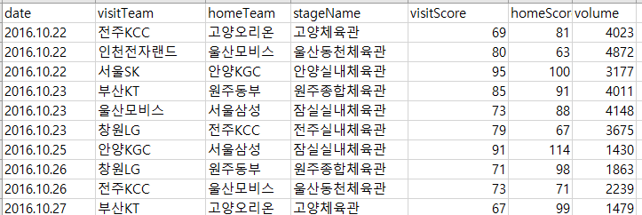

한국 프로 남자 농구 데이터를 csv로 가져오기. python.
python 의 selenium으로 가져왔습니다. chromeDriver 사용했습니다. 

https://www.kbl.or.kr/schedule/today/calendar.asp

이 사이트에서 날짜별로 경기가 나와있고, 클릭하면 세부정보가 나옵니다.

세부정보에서 원하는 정보들만 골라서 다음과 같이 csv파일로 저장하게 됩니다. 

